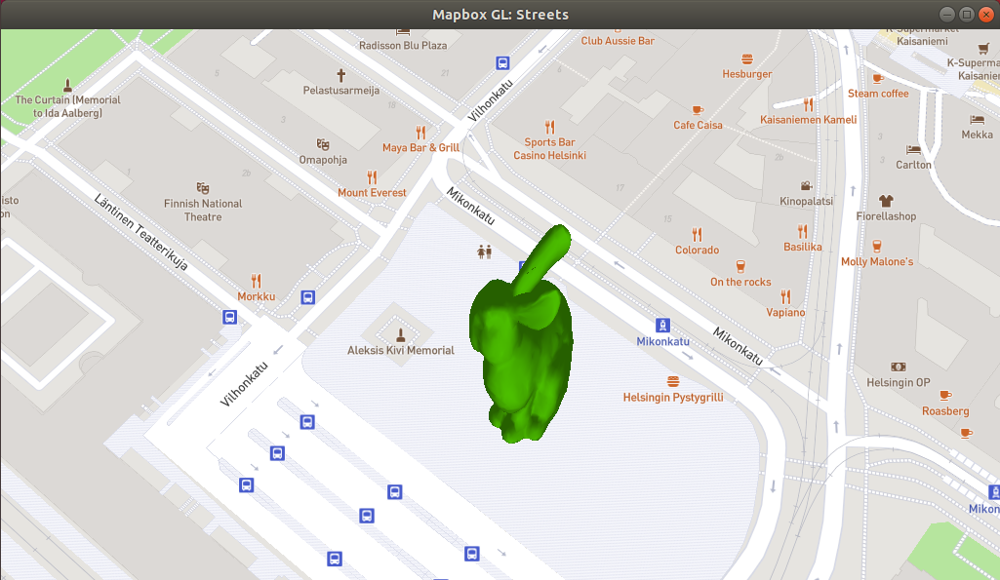

# Home assignment dev blog
## Task description
### Task
- [x] Create a Custom Layer in C++ for rendering an arbitrary 3D asset georeferenced the map. The asset will be transformed accordingly to the camera and locked to a coordinate
### Bonus
- [x] Multiple assets are supported
- [x] The asset is loaded from the network rather than from the filesystem
- [ ] Animated 3D assets
- [x] Only assets visible on the camera will be loaded
- [x] Low poly assets are loaded on lower zoom levels __(partly implemented)__.

## Prerequisites
The assignment was developed using Ubuntu and is not guaranteed to compile on other platforms. The only prerequisite is to setup a web server (or other location) for providing test assets for network streaming. On Ubuntu this can be easily achieved by running `python -m SimpleHTTPServer 8000` in mapbox-gl-native -folder. Test assets can be downloaded from `http://127.0.0.1:8000/test/obj/bunny.obj` after launching the server. The very same url is used by the application for streaming assets over the network.

Launch the glfw-app by running `BUILDTYPE=Release make run-glfw-app` and find your way to Helsinki city center (remember to setup the mapbox access token). :)
## Features
Two well-known 3D assets, Stanford teapot and Stanford bunny, have been placed to three different locations around Helsinki. One of the models is standing at Rautatientori located right next to the Helsinki office of Mapbox. The sample code provides a simple interface for defining latitude-longitude coordinates with local transformation for arbitrary number of meshes. Only OBJ-file parsers with simple normal vector shading was implemented due to the context and scope of the assignment.

I tried to follow coding conventions and data structures & utilities found on the repository, but shortcuts were taken in certain places. For example I implemented some basic vector operators of my own for easier mesh handling. 

Most of the tasks were quite straightforward to implement with few exceptions. I ended up doing frustum culling of visible meshes in clip space by comparing transformed mesh bounds against clip boundaries. This means that bounds have to be known in advance and the decision to stream the mesh must be made before culling (mesh bounds are computed during runtime). GPU upload still is done based on visibility information. LOD (level of detail) selection is done by determining screen space contribution for each model. I didn't include separate models for different LODs because the cost/benefit ratio would have been too high, but I implemented simple color coding to visualize the feature.

Asset animation was the only feature left out. Some kind of simple model rotation would have been trivial to implement but not very rewarding in the end. Spline interpolation and skeletal keyframe animations would have been very time consuming.

## Timeline

* __13.7.2019, Saturday__
  * __21:00__: I received the assignment and skimmed through the task list. Very interesting little programming challenge indeed! Technical & feature requirements are nothing too big, but learning a totally new ecosystem in the given time frame might end up being a challenge.
  * __22:30 - 01:15__: I started the task by setting up Ubuntu 18.04 LTS with Visual Code as development environment. I would have chosen windows if MSVC++ compiler was supported. It took few hours to get the glfw-app up and running with a test 3d triangle showing on the screen.
  * __time spent: 2:45__
* __14.7.2019, Sunday__
  * __10:30 - 13:45:__ Stanford bunny loaded from the filesystem and rendered on screen without georeferencing. Shaders are still bugging out but at least something is visible on the screen.
  * __time spent: 3:15__
* __15.7.2019, Monday__
  * __19:45 - 03:00:__ The main task finished and MVP ready for delivery! A single model can now be loaded and placed to the map by defining longitude-latitude coordinates (really hackish implementation). I spent nearly 4 hours banging my head against the wall trying to figure out the projection between planar and spherical coordinates. Documentation of the projection matrix passed to custom layers is non-existent and the actual logic behind the matrix is really complex. There should be a clear separation between "3D" and "map projection" projection matrices. But after the fight it was really satisfying to finally see the Stanford bunny standing on Helsinki Railway station right next to the Mapbox office. :)
  * __time spent: 7:15__
* __16.7.2019, Tuesday__
  * __12:00 - 19:30:__ Day started with refactoring and improving the initial solution. Bonus tasks were quite easy to finish after the projection matrix issue was resolved.
  * __time spent: 7:30__

Total time spent on the assignment __~20h 45min__ which is slightly less than 3 full work days.

## Thoughts

A very satisfying and well scoped crash course in Mapbox basics and it's native API. The greatest challenge ended up being  the API itself as many of it's features were poorly documented. I really like the coding style together with modern c++ features. I got really strong JAVA vibes from the strong OOP-approach (observer pattern, class inheritance, etc.)

## Known issues & future ideas
 - Many of the approaches and implementations were chosen to match the context and scope of the assignment. 
 - Tilting the camera causes some funny skewing.
 - All models are loaded to memory because model bounds are required for visibility culling. Upload to GPU happens only when the model is first visible on the screen.
 - Visibility checks are done in clip/projection space instead of world space. This is quite elegant solution although too conservative to be done in larger scale.
 - The proper approach for rendering and streaming 3d assets would be to partition world into 2D tiles (either grid or quadtree) and process assets in batches. 
 - A simple obj-loader was implemented. Some open source gltf loader would have been cool, but also very time consuming to integrate.
 - No retry logic if mesh load fails.
 - SIMD could be used for more performance.

